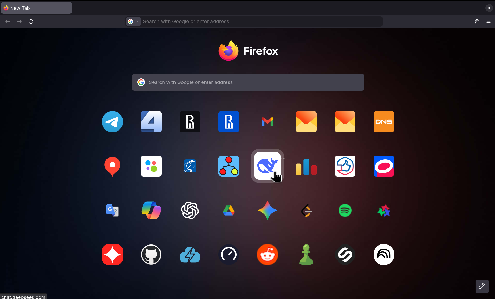

# My Dotfiles

## 🦊 Firefox UI customization


## 🖥️ Zsh config


## 📦 What's inside?

## 1. 🖥️ Zsh config
### ✨ Key Features

This setup is designed for those who love the **classic GNOME/Bash aesthetics** but want the **modern power of Zsh**.

* **Classic Look, Zsh Power:** Styled to resemble the standard GNOME Console (Bash-rice), keeping it familiar and clean.
* **Enhanced Highlighting:** Unlike basic Bash, this config highlights not just the username and folders, but also specific commands, aliases, and paths.
* **Two-Line Prompt:** A smart two-line layout ensures your commands always start from the same position, regardless of how deep you are in the file system.
* **Root Awareness:** The prompt symbol turns **Bold Red (#)** when running as root, providing a clear visual warning.
* **Smart Completion:** Includes `zsh-autosuggestions` and `compinit` for a faster, "IDE-like" terminal experience.
* **Focused Syntax:** Intentionally disables the distracting "red-on-type" error highlighting, keeping the interface calm and focused.

## 2. 🦊 Firefox Minimalist UI
### ✨ Key Features

A clean, distraction-free interface modification achieved strictly through `userChrome.css` and `userContent.css`.

* **Pure Minimalism:** Hidden tab close buttons, "New Tab" plus icon, and the "List all tabs" arrow to eliminate UI clutter.
* **Enhanced New Tab Icons:** Website titles are removed for a cleaner look. Icons are enlarged and centered to focus on visual recognition.
* **Smooth Animations:** Added a scale-up transition effect when hovering over top sites, making the dashboard feel responsive and modern.

## 📂 Structure

```text
.
├── zsh/
│   └── .zshrc
├── firefox/
│   ├── userChrome.css
│   └── userContent.css
└── .screenshots/
    ├── firefox-homepage.png
    └── zsh-preview.png