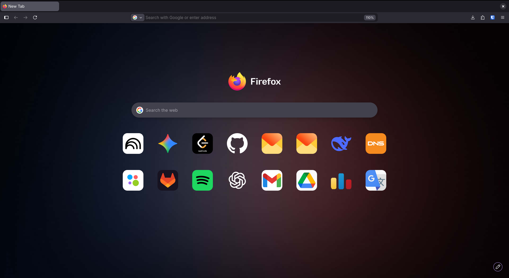
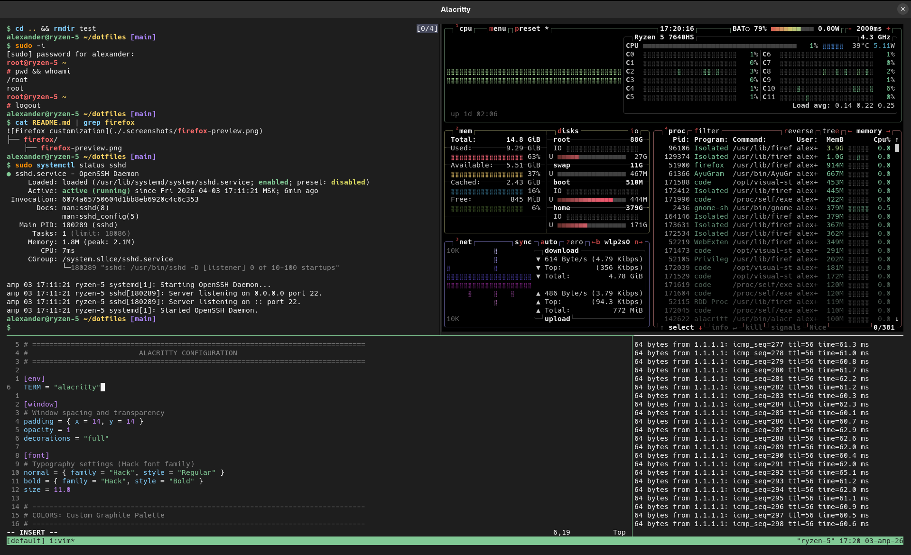

# 🛠️ My Dotfiles

## ⚙️ Installation
```bash
git clone https://github.com/ai-xandr/dotfiles.git
cd dotfiles
chmod +x install.sh
./install.sh
```

This repository utilizes **GNU Stow** for symbolic link management and automated deployment.

## Preview
### 🦊 Firefox UI customization


### 💻 Zsh + Alacritty + Tmux


## Technical Details

### 🐚 Shell (Zsh)
* **Process Management:** Automatic initialization and attachment to a named `tmux` session upon interactive shell startup.
* **Prompt Architecture:** Custom lightweight prompt including dynamic Git branch detection and status indicators.
* **Visual Enhancements:** Integration of `zsh-autosuggestions` and `zsh-syntax-highlighting` with a custom color schema optimized for path and command visibility.
* **Behavioral Flags:** Configured with `AUTO_CD`, `EXTENDED_GLOB`, and shared history across multiple active sessions.

### 🪟 Terminal Multiplexer (Tmux)
* **Clipboard Integration:** Configured with a Wayland-specific bridge via `wl-copy` for seamless buffer synchronization between the terminal and system environment.
* **Display:** Full TrueColor (`RGB`) and Alacritty terminal feature support enabled.
* **Ergonomics:** 1-based indexing for windows and panes; mouse-driven pane selection and scrolling active.

### 💻 Terminal Emulator (Alacritty)
* **Typography:** Integration of the Hack font family with specific padding adjustments for high-DPI displays.
* **Color Palette:** Implementation of a custom low-contrast "Graphite" theme.

### 📝 Text Editor (Vim)
* **Architecture:** Vanilla configuration designed for efficiency without reliance on external plugin managers.
* **Storage Isolation:** Persistent `undo` and `swap` files are hardware-isolated in dedicated `~/.vim/` subdirectories to prevent filesystem clutter.
* **UX:** Native support for normal mode commands while utilizing Cyrillic keyboard layouts via `langmap`.

### 🦊 Browser (Firefox)
* **Interface Modification:** Custom UI hardening via `userChrome.css` and `userContent.css`.
* **Visuals:** Implementation of a streamlined "New Tab" page with custom CSS transitions and background rendering.
* **Minimalism:** Removal of native tab-close buttons and secondary navigation elements to maximize vertical screen real estate.

## 📂 Structure

```text
.
├── alacritty
│   └── .config
│       └── alacritty
│           └── alacritty.toml
├── firefox
│   ├── img
│   │   └── dark-gradient-background.jpg
│   ├── userChrome.css
│   └── userContent.css
├── install.sh
├── README.md
├── .screenshots
│   ├── firefox-preview.png
│   ├── vim-preview.png
│   └── zsh-alacritty-preview.png
├── tmux
│   └── .tmux.conf
├── vim
│   └── .vimrc
└── zsh
    └── .zshrc